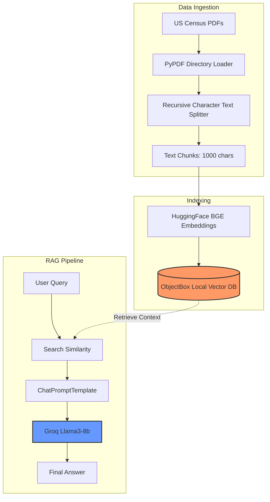
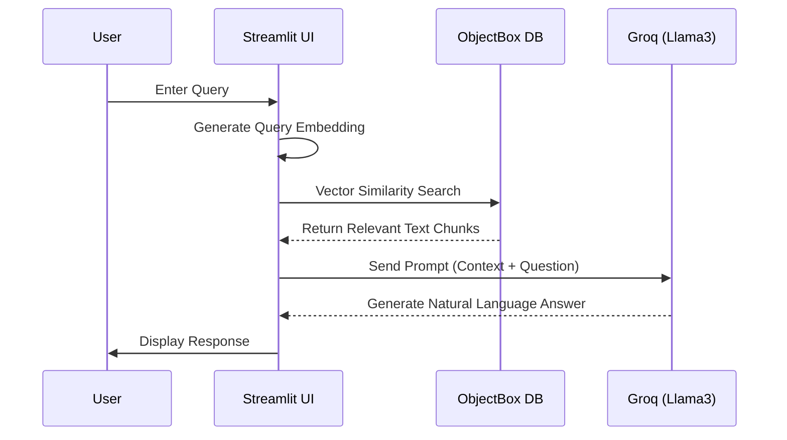

# End to End RAG Project using ObjectBox and LangChain
 - In this end to end project I have built a RAG app using ObjectBox Vector Databse and LangChain. RAG techniques allow us to augment a language model's knowledge base actively, ensuring your AI can access and reason with your data and the very latest information. With ObjectBox you can do that, without the data ever needing to leave the device.

## **1. High-Level Flowchart**

This diagram tracks the data from the raw PDF stage through to the final LLM response.

## **2. Sequence Diagram**

This shows the interaction between the components when a user asks a question.

## Description
- This project showcases the implementation of an advanced RAG system that uses Objectbox vectordatabase and Groq's LLAM3 model as an llm to retrieve information from different PDF documents.

Steps I followed:
1. I have used the `PyPdfDirectoryLoader` from the `langchain_community` document loader to load the PDF documents from the `us-census-data` directory.
2. Transformed each text into a chunk of `1000` using the `RecursiveCharacterTextSplitter` imported from the `langchain.text_splitter`
3. Stored the vector embeddings which were made using the `HuggingFaceBgeEmbeddings` using the `ObjectBox` vector store.
4. Setup the llm `ChatGroq` with the model name `Llama3-8b-8192`
5. Setup `ChatPromptTemplate`
6. Setup `vector_embedding` function to embed the documents and store them in the `ObjectBox` vector store
7. Finally created the `document_chain` and `retrieval_chain` for chaining llm to prompt and `retriever` to `document_chain` respectively

## Libraries Used
 - langchain==0.1.20
 - langchain-community==0.0.38
 - langchain-core==0.1.52
 - langchain-groq==0.1.3
 - langchain-objectbox
 - python-dotenv==1.0.1
 - pypdf==4.2.0

## Installation
 1. Prerequisites
    - Git
    - Command line familiarity
 2. Clone the Repository: `git clone https://github.com/hamzaakmal98/End-to-End-RAG-ObjectBox-LangChain.git`
 3. Create and Activate Virtual Environment (Recommended)
    - `python -m venv venv`
    - `source venv/bin/activate`
 4. Navigate to the projects directory `cd ./End-to-End-RAG-ObjectBox-LangChain.git` using your terminal
 5. Install Libraries: `pip install -r requirements.txt`
 6. Navigate to the app directory `cd ./app` using your terminal 
 7. Run `streamlit run app.py`
 8. Open the link displayed in the terminal on your preferred browser
 9. As I have already embedded the documents you don't need to click on the `Embed Documents` button/ But, if it's not working then you need to click on the `Embed Documents` button and wait until the documnets are processed
 10. Enter your question from the PDFs found in the `us-census-data` directory

## Collaboration
- Collaborations are welcomed ❤️

